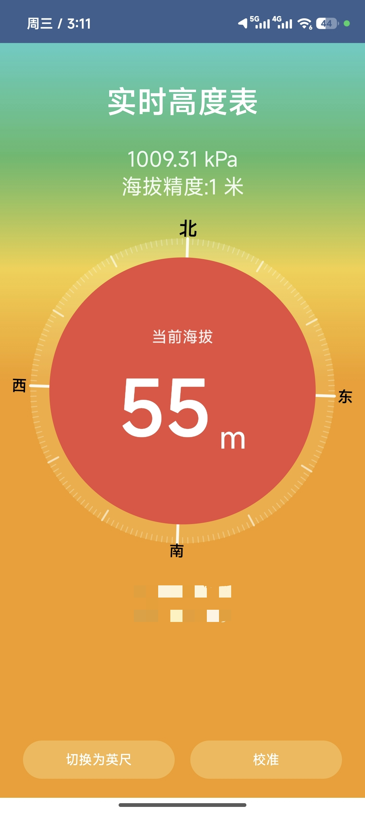

# Altimeter - 实时高度表

<div align="center">

一款基于 Android 的实时高度表应用，使用气压传感器和 GPS 双数据源精确测量海拔高度。


</div>

---

## 📱 功能特性

### 核心功能

- **🎯 双数据源测量**
  - 气压传感器：精度 ±1 米（设备支持时）
  - GPS 定位：精度 ±5-50 米（备选方案）

- **📊 实时数据显示**
  - 当前海拔高度（支持米/英尺切换）
  - 实时气压值（kPa）
  - 海拔精度估算
  - 指南针方向指示（360°刻度环）

- **⚙️ 智能校准**
  - 已知高度校准：输入已知海拔自动计算海平面气压
  - 手动气压校准：输入当地海平面气压值
  - 校准值持久化保存（SharedPreferences）

- **🎨 现代化 UI**
  - Jetpack Compose + Material Design 3
  - 渐变背景配色
  - 动态 compass 刻度环
  - 深色主题支持

### 技术亮点

| 特性 | 实现方式 |
|------|----------|
| 数据平滑 | 滑动窗口平均（气压 10 样本，方位角 5 样本） |
| 高度计算 | 国际标准大气 (ISA) 公式 |
| 传感器融合 | 加速度计 + 磁力计计算方位角 |
| 架构模式 | MVVM + LiveData |

---

## 🖼️ 界面预览

### 主界面



---

## 🏗️ 项目结构

```
app/
└── src/main/
    ├── java/com/altimeter/
    │   ├── MainActivity.kt          # 主 Activity，权限处理
    │   ├── ui/
    │   │   ├── AltimeterScreen.kt   # 主界面 UI（含指南针刻度环）
    │   │   ├── CalibrationDialog.kt # 校准对话框（已知高度/手动气压）
    │   │   └── theme/
    │   │       └── Theme.kt         # Material 主题定义
    │   ├── viewmodel/
    │   │   └── AltitudeViewModel.kt # 传感器数据管理（气压/GPS/指南针）
    │   └── utils/
    │       └── AltitudeCalculator.kt# 高度计算工具类（ISA 公式）
    ├── res/                         # 资源文件
    └── AndroidManifest.xml
```

### 核心模块说明

| 模块 | 职责 |
|------|------|
| `MainActivity` | 应用入口，处理位置权限请求 |
| `AltitudeViewModel` | 管理气压传感器、GPS、指南针数据流 |
| `AltimeterScreen` | 主界面 Composable，显示高度和指南针 |
| `CalibrationDialog` | 校准对话框，支持两种校准方式 |
| `AltitudeCalculator` | 纯函数计算：气压→高度、米↔英尺转换 |

---

## 🚀 快速开始

### 环境要求

- **JDK**: 17+
- **Android Gradle Plugin**: 8.2.0
- **Kotlin**: 1.9.20
- **Compile SDK**: 34
- **Min SDK**: 26 (Android 8.0+)

### 构建项目

```bash
# 克隆项目
git clone <repository-url>
cd altimeter

# 编译 Debug 版本
./gradlew assembleDebug

# 编译 Release 版本
./gradlew assembleRelease

# 安装到连接的设备
./gradlew installDebug

# 运行完整构建（包含测试）
./gradlew build

# 清理构建
./gradlew clean
```

### 运行测试

```bash
# 运行单元测试
./gradlew test

# 运行仪器测试（需要设备/模拟器）
./gradlew connectedAndroidTest
```

---

## 📐 技术架构

### MVVM 架构图

```
┌─────────────────────────────────────────────┐
│                  View Layer                 │
│  ┌─────────────────────────────────────┐    │
│  │     MainActivity.kt                 │    │
│  │  - 权限请求                         │    │
│  │  - 生命周期管理                     │    │
│  └──────────────┬──────────────────────┘    │
│                 │                            │
│  ┌──────────────▼──────────────────────┐    │
│  │     AltimeterScreen.kt              │    │
│  │  - Jetpack Compose UI               │    │
│  │  - 指南针刻度环绘制                 │    │
│  │  - 校准对话框                       │    │
│  └──────────────┬──────────────────────┘    │
└─────────────────│───────────────────────────┘
                  │ observeAsState
┌─────────────────│───────────────────────────┐
│           ViewModel Layer                   │
│  ┌──────────────▼──────────────────────┐    │
│  │     AltitudeViewModel.kt            │    │
│  │  - 传感器数据管理                   │    │
│  │  - LiveData 数据流                  │    │
│  │  - 数据平滑处理                     │    │
│  │  - 校准逻辑                         │    │
│  └──────────────┬──────────────────────┘    │
└─────────────────│───────────────────────────┘
                  │ 调用
┌─────────────────│───────────────────────────┐
│            Utility Layer                    │
│  ┌──────────────▼──────────────────────┐    │
│  │     AltitudeCalculator.kt           │    │
│  │  - ISA 高度计算公式                 │    │
│  │  - 单位转换                         │    │
│  │  - 精度估算                         │    │
│  └─────────────────────────────────────┘    │
└─────────────────────────────────────────────┘
```

### 数据流

```
传感器硬件 → SensorEventListener → ViewModel (平滑处理) → LiveData → Compose UI
     ↓
气压传感器 ──→ 气压值 (kPa) ──→ 高度计算 ──→ 海拔显示
GPS ─────────→ 经纬度/高度 ──→ 坐标显示
加速度计 + 磁力计 ─→ 方位角 ──→ 指南针旋转
```

---

## 🧮 高度计算原理

### 国际标准大气 (ISA) 公式

应用使用标准气压高度公式计算海拔：

```
h = 44330 × (1 - (P / P₀)^(1/5.255))
```

**参数说明：**
- `h` = 高度（米）
- `P` = 当前气压（hPa）
- `P₀` = 海平面参考气压（hPa），默认 1013.25

### 校准原理

当用户输入已知高度 `h_known` 时，反向计算海平面气压：

```
P₀ = P / (1 - h_known / 44330)^5.255
```

### 精度估算

典型气压传感器精度 ±0.12 hPa，对应约 **±1 米** 高度误差。

---

## 📋 权限说明

应用需要以下运行时权限：

| 权限 | 用途 | 必需性 |
|------|------|--------|
| `ACCESS_FINE_LOCATION` | 获取 GPS 精确位置 | 可选（无则仅用气压） |
| `ACCESS_COARSE_LOCATION` | 获取 GPS 粗略位置 | 可选 |

> **注意**：气压传感器读取不需要额外权限，但需要硬件支持。

### AndroidManifest 配置

```xml
<uses-permission android:name="android.permission.ACCESS_FINE_LOCATION" />
<uses-permission android:name="android.permission.ACCESS_COARSE_LOCATION" />
<uses-feature android:name="android.hardware.sensor.barometer" android:required="false" />
```

---

## 🛠️ 开发指南

### 代码风格

- 遵循 [Kotlin 官方代码风格](https://kotlinlang.org/docs/coding-conventions.html)
- 缩进：4 空格
- 命名规范：
  - 类名：PascalCase（如 `AltitudeViewModel`）
  - 函数/变量：camelCase（如 `calculateAltitude`）
  - 常量：SCREAMING_SNAKE_CASE（如 `STANDARD_SEA_LEVEL_PRESSURE`）

### 添加新功能

1. **新增传感器类型**：在 `AltitudeViewModel` 中添加 SensorEventListener
2. **新增 UI 组件**：在 `ui/` 目录创建 Composable 函数
3. **新增计算逻辑**：在 `AltitudeCalculator` 添加纯函数

### 调试技巧

```kotlin
// 在 ViewModel 中开启日志
private val TAG = "AltitudeViewModel"

// 使用 Logcat 过滤
adb logcat -s AltitudeViewModel
```

---

## 📦 依赖项

### 核心依赖

```gradle
// AndroidX Core
implementation 'androidx.core:core-ktx:1.12.0'

// Jetpack Compose
implementation "androidx.compose.ui:ui:$compose_version"
implementation "androidx.compose.ui:ui-tooling-preview:$compose_version"
implementation 'androidx.compose.material3:material3:1.2.0'

// Lifecycle + ViewModel
implementation 'androidx.lifecycle:lifecycle-runtime-ktx:2.6.2'
implementation 'androidx.lifecycle:lifecycle-viewmodel-compose:2.6.2'
implementation 'androidx.lifecycle:lifecycle-livedata-ktx:2.6.2'

// Activity Compose
implementation 'androidx.activity:activity-compose:1.8.1'

// LiveData for Compose
implementation 'androidx.compose.runtime:runtime-livedata:$compose_version'

// Google Play Services Location
implementation 'com.google.android.gms:play-services-location:21.0.1'
```

---

## 📱 硬件兼容性

| 硬件特性 | 要求 | 说明 |
|----------|------|------|
| 气压传感器 | 可选 | 有传感器时精度 ±1 米，无传感器时使用 GPS |
| GPS | 可选 | 无气压传感器时的备选方案 |
| 加速度计 | 必需 | 用于指南针功能 |
| 磁力计 | 必需 | 用于指南针功能 |

---

## 🤝 贡献

欢迎提交 Issue 和 Pull Request！

1. Fork 本项目
2. 创建功能分支 (`git checkout -b feature/AmazingFeature`)
3. 提交更改 (`git commit -m 'Add some AmazingFeature'`)
4. 推送到分支 (`git push origin feature/AmazingFeature`)
5. 开启 Pull Request

---

## 📄 许可证

本项目采用 MIT 许可证 - 查看 [LICENSE](LICENSE) 文件了解详情。

---

## 📞 联系方式

- 项目地址：[GitHub Repository](https://github.com/yourusername/altimeter)
- 问题反馈：[Issues](https://github.com/yourusername/altimeter/issues)

---

<div align="center">

**Made with ❤️ using Kotlin + Jetpack Compose**

</div>
